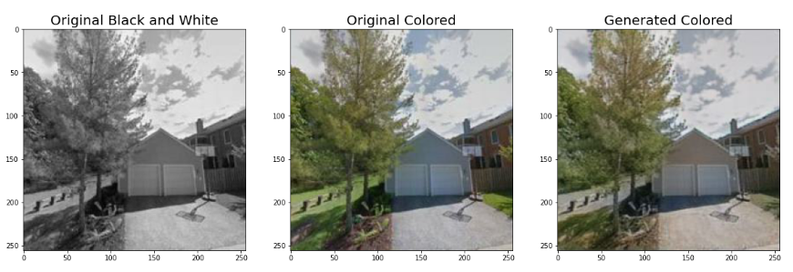

# Colorization of Black and White Images
An image-to-image translation GAN to colorize black and white images using a customized version of the model from the [Pix2Pix](https://phillipi.github.io/pix2pix/) research paper. The model uses a modified generator compared to the original paper which leads to better results. Instead of using the standard U-Net, this model replaces the encoder part of U-Net with pretrained ResNet18.

This notebook was ran on Kaggle, and it uses the [House Rooms & Streets Image Dataset](https://www.kaggle.com/datasets/mikhailma/house-rooms-streets-image-dataset) available on Kaggle.

  

